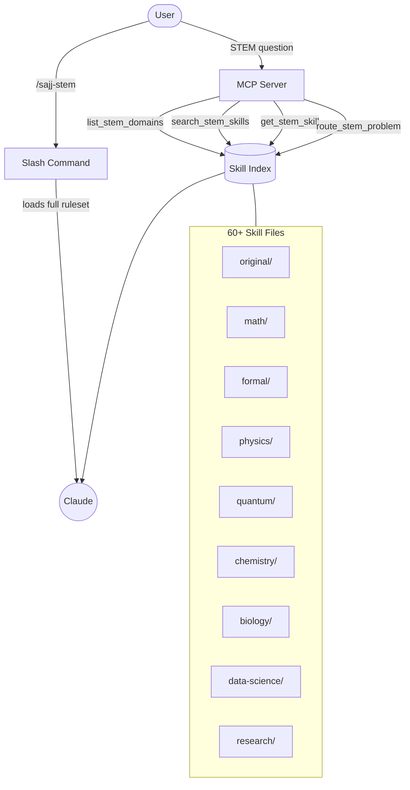
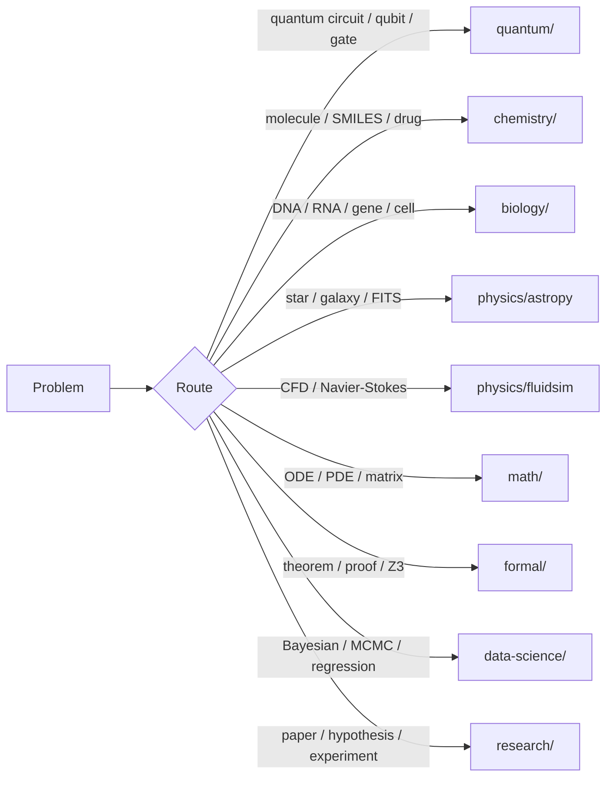
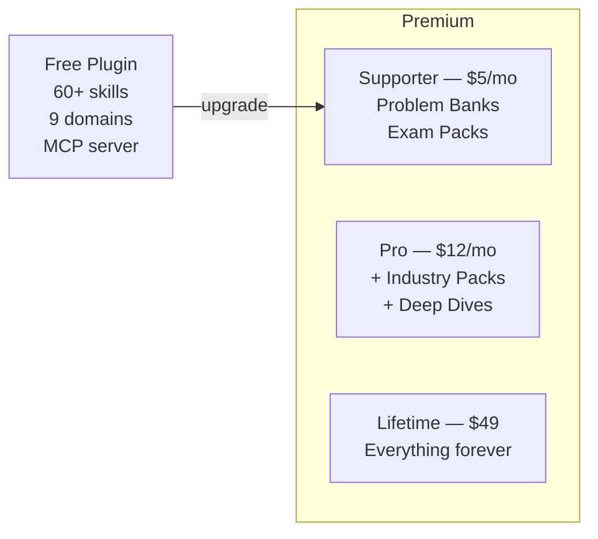

# Sajj STEM Plugin


[](https://github.com/sponsors/sajjfy)
[](https://ko-fi.com/s/2d20bb069a)

> A comprehensive STEM expert plugin for Claude Code — 60+ skills across 9 domains with a built-in MCP server for on-demand skill discovery.

---

## Overview

```
Physics · Quantum Computing · Chemistry · Biology
Mathematics · Engineering · Design · Data Science · Research
```

When activated, this plugin turns Claude into a step-by-step STEM expert that automatically identifies the domain of your problem, loads the right specialist skill, and solves with full working shown at every step.

---

## Architecture



---

## Installation

**Step 1 — Add the marketplace:**
```bash
claude plugin marketplace add https://github.com/sajjfy/STEM-SAJJ
```

**Step 2 — Install the plugin:**
```bash
claude plugin install sajj-stem
```

**Step 3 — Restart Claude Code**, then activate in any session:
```
/sajj-stem
```

---

## MCP Server

The plugin ships a built-in **MCP server** that provides 4 tools for dynamic skill discovery — Claude can search and load skills on demand instead of loading everything at once.

| Tool | Description |
|------|-------------|
| `list_stem_domains` | List all 9 domains with skill counts and descriptions |
| `search_stem_skills` | Full-text search across 60+ skills by keyword or topic |
| `get_stem_skill` | Load the full content of any skill file on demand |
| `route_stem_problem` | Given a problem, auto-detect domain and suggest the right skills |

The MCP server starts automatically when the plugin loads. Skills are served from `skills/` relative to the installed plugin root.

---

## What It Does

When activated, Claude applies these behaviours across all STEM domains:

- States the formula or method **before** applying it
- Shows **full step-by-step working** with units at every step
- **Identifies the domain** (physics, chemistry, biology, etc.) before solving
- **Routes automatically** to the correct specialist skill
- **Checks answers** via dimensional analysis and sanity checks
- Uses **SI units** by default (m, kg, s, N, Pa, J, W)
- Reports results to **3 significant figures** unless specified otherwise
- Flags physically unreasonable results and re-checks

---

## Skill Index

### Original Skills — `skills/original/` (6 skills)

| Skill | Topics |
|-------|--------|
| `applied-physics.md` | Mechanics, Fluids, Thermodynamics, Electromagnetism, Waves, Modern Physics |
| `linear-algebra.md` | Matrices, Eigenvalues, Vector Spaces, SVD, LU, Gram-Schmidt |
| `quantum.md` | Dirac Notation, Schrödinger Equation, Density Matrices, Quantum Gates |
| `engineering-math.md` | Structural Analysis, ODEs, Laplace Transforms, Fourier, Signal Processing |
| `geometry.md` | 2D/3D Shapes, Trigonometry, Vectors, Coordinate Geometry, Transformations |
| `design-math.md` | UI/UX Layout Math, Industrial Design, Mechanical Design, Golden Ratio |

---

### Advanced Mathematics — `skills/math/` (11 skills)
> Sourced from [cc-polymath](https://github.com/rand/cc-polymath)

| Skill | Topics |
|-------|--------|
| `differential-equations.md` | ODEs, PDEs, RK4, Phase Plane, Stability Analysis |
| `linear-algebra-computation.md` | Ax=b Systems, Gaussian Elimination, Decompositions |
| `numerical-methods.md` | Root Finding, Numerical Integration, Interpolation, Error Analysis |
| `probability-statistics.md` | Distributions, Bayes, Hypothesis Testing, Regression, CLT |
| `optimization-algorithms.md` | Gradient Descent, Convex Optimisation, LP, Newton's Method |
| `abstract-algebra.md` | Groups, Rings, Fields, Galois Theory, Homomorphisms |
| `number-theory.md` | Primes, Modular Arithmetic, CRT, Cryptographic Applications |
| `set-theory.md` | ZFC Axioms, Cardinals, Ordinals, Axiom of Choice |
| `topology-point-set.md` | Metric Spaces, Open Sets, Compactness, Continuity, Connectedness |
| `topology-algebraic.md` | Fundamental Groups, Homology, Homotopy, Euler Characteristic |
| `category-theory-foundations.md` | Functors, Natural Transformations, Adjunctions, Yoneda Lemma |

---

### Formal Methods — `skills/formal/` (10 skills)
> Sourced from [cc-polymath](https://github.com/rand/cc-polymath)

| Skill | Topics |
|-------|--------|
| `lean-theorem-proving.md` | Lean 4 Proofs, Type Theory, Curry-Howard |
| `lean-mathlib4.md` | Formalising Mathematics with Mathlib4 |
| `lean-tactics.md` | `simp`, `ring`, `linarith`, `omega`, Tactic Automation |
| `lean-proof-basics.md` | Lean 4 from Scratch, Syntax, Types |
| `sat-solving-strategies.md` | SAT, DPLL, CDCL, Clause Learning |
| `smt-theory-applications.md` | SMT Theories, Arithmetic, Arrays, Bitvectors |
| `z3-solver-basics.md` | Z3 Python API, `Solver()`, `check()`, `model()` |
| `csp-modeling.md` | Constraint Satisfaction, Scheduling, Graph Colouring |
| `constraint-propagation.md` | Arc Consistency, AC-3, Domain Reduction |
| `backtracking-search.md` | MRV Heuristic, Forward Checking, Backtracking |

---

### Physics — `skills/physics/` (2 skills)
> Sourced from [ordinary-claude-skills](https://github.com/Microck/ordinary-claude-skills)

| Skill | Topics |
|-------|--------|
| `astropy.md` | Celestial Coordinates, FITS Files, Units, Cosmology, Time Scales, WCS |
| `fluidsim.md` | Navier-Stokes 2D/3D, Pseudospectral Methods, Turbulence, HPC/MPI |

---

### Quantum Computing — `skills/quantum/` (4 skills)
> Sourced from [ordinary-claude-skills](https://github.com/Microck/ordinary-claude-skills)

| Skill | Topics |
|-------|--------|
| `cirq.md` | Quantum Circuits, Simulation, Google Hardware, VQE, QAOA, Noise Modeling |
| `qiskit.md` | IBM Quantum, Circuit Composition, Transpilation, Primitives |
| `pennylane.md` | Quantum ML, Variational Circuits, Parameter-Shift Gradients, PyTorch/JAX |
| `qutip.md` | Quantum Optics, Open Systems, Lindblad Master Equation, Wigner Functions |

---

### Chemistry — `skills/chemistry/` (5 skills)
> Sourced from [ordinary-claude-skills](https://github.com/Microck/ordinary-claude-skills)

| Skill | Topics |
|-------|--------|
| `rdkit.md` | SMILES/SDF, Descriptors (MW, LogP, TPSA), Fingerprints, Similarity, 3D Gen |
| `deepchem.md` | Molecular ML, GNNs, MoleculeNet, ADMET, Drug Discovery, Scaffold Split |
| `cobrapy.md` | Metabolic Modeling, FBA, FVA, Gene Knockouts, SBML, Systems Biology |
| `pymatgen.md` | Crystal Structures, Space Groups, DFT Interfaces, VASP, Materials Analysis |
| `datamol.md` | Molecular Workflows, Drug-likeness, SMILES Standardisation |

---

### Biology — `skills/biology/` (5 skills)
> Sourced from [ordinary-claude-skills](https://github.com/Microck/ordinary-claude-skills)

| Skill | Topics |
|-------|--------|
| `biopython.md` | Sequences, NCBI/Entrez, FASTA/GenBank, BLAST, Phylogenetics |
| `scanpy.md` | scRNA-seq, QC, Normalisation, PCA, UMAP, Leiden Clustering |
| `scvi-tools.md` | Probabilistic Single-Cell Models, Batch Correction, Multimodal Integration |
| `neurokit2.md` | ECG, EEG, EDA, RSP, PPG, HRV, Biosignal Processing |
| `scikit-bio.md` | Diversity Metrics, Phylogeny, Sequence Alignments, OTU Tables |

---

### Data Science & Scientific Computing — `skills/data-science/` (8 skills)
> Sourced from [ordinary-claude-skills](https://github.com/Microck/ordinary-claude-skills)

| Skill | Topics |
|-------|--------|
| `sympy.md` | Symbolic Math, CAS, Differentiation, Integration, LaTeX Output |
| `statsmodels.md` | Regression, Time Series, ANOVA, Hypothesis Tests |
| `pymc.md` | Bayesian Inference, MCMC, Prior/Posterior, NUTS Sampler |
| `pymoo.md` | Multi-Objective Optimisation, NSGA-II, Pareto Front |
| `statistical-analysis.md` | Statistical Workflows, Effect Sizes, Confidence Intervals |
| `scientific-visualization.md` | Publication-Quality Plots, matplotlib, seaborn, colour maps |
| `networkx.md` | Graph Theory, Shortest Paths, Centrality, Community Detection |
| `exploratory-data-analysis.md` | EDA Pipelines, Profiling, Distributions, Correlations, Outliers |

---

### Research Skills — `skills/research/` (5 skills)
> Sourced from [ordinary-claude-skills](https://github.com/Microck/ordinary-claude-skills)

| Skill | Topics |
|-------|--------|
| `scientific-writing.md` | Paper Structure, Methods, Results, LaTeX, Abstract Writing |
| `scientific-brainstorming.md` | Research Ideation, Interdisciplinary Connections, Gap Analysis |
| `scientific-critical-thinking.md` | Experimental Design, Bias, Reproducibility, Effect Sizes |
| `literature-review.md` | Survey Writing, Citation Strategy, Synthesis, Databases |
| `hypothesis-generation.md` | Falsifiable Hypotheses, Research Questions, Competing Explanations |

---

## Domain Routing

The MCP server automatically routes problems to the right skill:



| You ask about... | Skill activated |
|-----------------|-----------------|
| Astronomical data, FITS, cosmology | `physics/astropy` |
| Fluid dynamics, CFD, Navier-Stokes | `physics/fluidsim` |
| Quantum circuits, gates, algorithms | `quantum/cirq` or `quantum/qiskit` |
| Quantum ML, variational circuits | `quantum/pennylane` |
| Quantum optics, open quantum systems | `quantum/qutip` |
| Molecules, SMILES, drug-likeness | `chemistry/rdkit` + `chemistry/datamol` |
| Molecular ML, ADMET prediction | `chemistry/deepchem` |
| Metabolic networks, flux analysis | `chemistry/cobrapy` |
| Crystal structures, materials DFT | `chemistry/pymatgen` |
| DNA/protein sequences, NCBI queries | `biology/biopython` |
| Single-cell RNA-seq analysis | `biology/scanpy` |
| ECG, EEG, biosignal processing | `biology/neurokit2` |
| Symbolic calculus, algebra | `data-science/sympy` |
| Bayesian inference, MCMC | `data-science/pymc` |
| Multi-objective optimisation | `data-science/pymoo` |
| Graph / network analysis | `data-science/networkx` |
| Writing a paper, Methods section | `research/scientific-writing` |
| Designing an experiment | `research/scientific-critical-thinking` |
| ODEs, PDEs, stability analysis | `math/differential-equations` |
| Theorem proving, Lean 4 | `formal/lean-theorem-proving` |
| SAT/SMT solving, Z3 | `formal/smt-theory-applications` |

---

## Repository Structure

```
STEM-SAJJ/
├── .claude-plugin/
│   ├── plugin.json                    Plugin manifest (v2.1.0)
│   └── marketplace.json               Marketplace registration
├── .mcp.json                          MCP server declaration
├── mcp-server/
│   ├── index.js                       MCP server (4 tools)
│   └── package.json                   Dependencies
├── commands/
│   └── sajj-stem.md                   /sajj-stem slash command
├── plugin.md                          Plugin entry point & skill index
├── sajj-stem.md                       Full skill ruleset (slash command copy)
├── README.md                          This file
├── LICENSE                            MIT
│
└── skills/
    ├── original/     (6)              Core STEM skills
    ├── math/         (11)             Advanced mathematics — cc-polymath
    ├── formal/       (10)             Formal methods — cc-polymath
    ├── physics/      (2)              Physics tools — ordinary-claude-skills
    ├── quantum/      (4)              Quantum computing — ordinary-claude-skills
    ├── chemistry/    (5)              Chemistry & materials — ordinary-claude-skills
    ├── biology/      (5)              Biology & biosignals — ordinary-claude-skills
    ├── data-science/ (8)              Data science — ordinary-claude-skills
    └── research/     (5)             Scientific research — ordinary-claude-skills
```

---

## Usage Examples

```
/sajj-stem

> A beam of 6m with a 500N point load at midpoint — find reactions at supports
> Find the eigenvalues of [[3,1],[1,3]] and interpret geometrically
> Build a Cirq circuit for a Bell state and sample it 1000 times
> Load aspirin as a SMILES string and calculate LogP and TPSA with RDKit
> Parse a FASTA file and run a BLAST search against NCBI nt
> Set up a Bayesian linear regression with PyMC and sample the posterior
> What is the time evolution of |ψ⟩ = (|0⟩+|1⟩)/√2 under H = ℏω σ_z?
> Formulate the Lotka-Volterra equations and analyse stability at equilibrium
> Calculate the luminosity distance to a galaxy at z = 0.5 using Planck18
> Prove that the sum of two even integers is even in Lean 4
```

---

## Changelog

### v2.1.0
- Added MCP server with 4 tools: `list_stem_domains`, `search_stem_skills`, `get_stem_skill`, `route_stem_problem`
- Added `.mcp.json` for automatic MCP server wiring
- Added `commands/` directory for proper slash command registration

### v2.0.0
- Restructured into 9 skill domains
- Added 30 skills from ordinary-claude-skills: astropy, fluidsim, cirq, qiskit, pennylane, qutip, rdkit, deepchem, cobrapy, pymatgen, datamol, biopython, scanpy, scvi-tools, neurokit2, scikit-bio, sympy, statsmodels, pymc, pymoo, and more
- Added `.claude-plugin/` manifests for marketplace install

### v1.0.0
- Initial release with 6 core STEM skills

---

## Premium

The free plugin covers 60+ general STEM skills. The **Premium tier** adds deep problem banks, exam prep packs, and industry-specific workflows.



| Tier | Price | Includes |
|------|-------|---------|
| **Supporter** | $5/mo | 200+ worked problems (Mechanics, Calculus, Linear Algebra, Stats), A-Level & IB exam packs |
| **Pro** | $12/mo | Everything above + Industry packs (Drug Discovery, Quantum Hardware, Materials Science) + Deep Dives (Bayesian, Quantum ML) |

**How it works:** Sponsor → open an issue with your GitHub username → get invited to the private premium repo within 24h.

[](https://github.com/sponsors/sajjfy)
[](https://ko-fi.com/s/2d20bb069a)

---

## Credits

Skills sourced and adapted from:
- [cc-polymath](https://github.com/rand/cc-polymath) — Advanced mathematics and formal methods
- [ordinary-claude-skills](https://github.com/Microck/ordinary-claude-skills) — Scientific computing and research skills

---

## License

MIT License — Copyright (c) 2026 Sajifal Sulaiman

See [LICENSE](./LICENSE) for full text.
